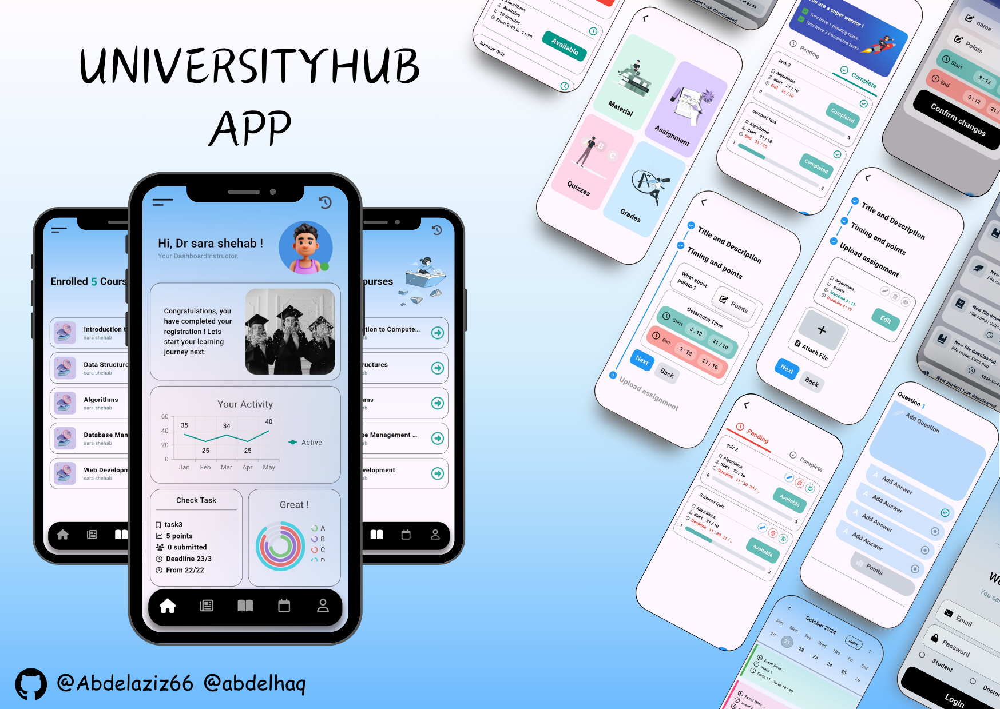

# 🎓 Graduation Project! "UniversityHub" App!

**Learning Management System** – This application offers two distinct roles: **student** and **instructor**, ensuring tailored experiences for both. Collaborating with my talented teammate, **Abdelhaq Adel**, we’re proud to have earned an **A grade** for this project.

The application leverages **Flutter**'s robust capabilities to deliver an efficient, user-friendly experience for both roles.

---

## Student Role

Each student is provided with a personal account that stores their individual information and course details. Through this account, students can access and download lecture materials and lab assignments for each course. They can view tasks, submit answers, and check their grades for both tasks and quizzes.

Each student also benefits from a personalized dashboard that adapts to their activity and academic level.

---

## Instructor Role

Each instructor is provided with a personal account containing their information, courses, and a list of students enrolled in those courses. Instructors can add, edit, delete, and access lectures and lab materials for each course.

They are also able to manage tasks, including adding, editing, deleting, and viewing student submissions, as well as assigning grades. Instructors have the ability to create, edit, or delete quizzes, and access quiz results for each student.

Each instructor also benefits from a personalized dashboard tailored to their activity and level.

---

## Shared Features

- **Calendar**: Both students and instructors have a calendar to organize and save events.
- **Timeline**: Both roles have access to a timeline that displays posts related to news and events.
- **Activity History**: Every user has a history that records all their activities within the app for easy tracking and reference.
- **Offline Access**: Both students and instructors can access course materials offline, ensuring uninterrupted learning and resource access.

🔗 check the link to see the full video in Linkedin 
[Linkedin Post](www.linkedin.com/in/abdelaziz-elsayed-aab278252)

# 🎓 Graduation Project! "UniversityHub" App!

**Learning Management System** – This application offers two distinct roles: **student** and **instructor**, ensuring tailored experiences for both. Collaborating with my talented teammate, **Abdelhaq Adel**, we’re proud to have earned an **A grade** for this project.

The application leverages **Flutter**'s robust capabilities to deliver an efficient, user-friendly experience for both roles.

---

## Student Role

Each student is provided with a personal account that stores their individual information and course details. Through this account, students can access and download lecture materials and lab assignments for each course. They can view tasks, submit answers, and check their grades for both tasks and quizzes.

Each student also benefits from a personalized dashboard that adapts to their activity and academic level.

---

## Instructor Role

Each instructor is provided with a personal account containing their information, courses, and a list of students enrolled in those courses. Instructors can add, edit, delete, and access lectures and lab materials for each course.

They are also able to manage tasks, including adding, editing, deleting, and viewing student submissions, as well as assigning grades. Instructors have the ability to create, edit, or delete quizzes, and access quiz results for each student.

Each instructor also benefits from a personalized dashboard tailored to their activity and level.

---

## Shared Features

- **Calendar**: Both students and instructors have a calendar to organize and save events.
- **Timeline**: Both roles have access to a timeline that displays posts related to news and events.
- **Activity History**: Every user has a history that records all their activities within the app for easy tracking and reference.
- **Offline Access**: Both students and instructors can access course materials offline, ensuring uninterrupted learning and resource access.

🔗 check the link to see the full video in Linkedin 
[Linkedin Post](www.linkedin.com/in/abdelaziz-elsayed-aab278252)

